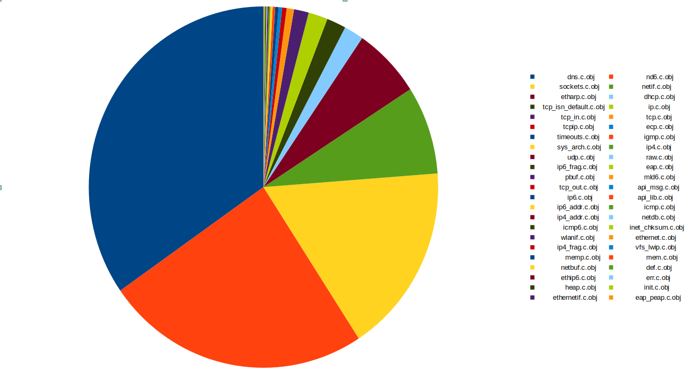

# lwIP for IDF developers

*Everything You Always Wanted to Know About `lwip`...*

* lwIP Overview
* IDF port layer
* lwIP vs esp-lwip
* Tips and Tweaks
* How we debug/test lwip
* Future considerations

---


---

# Demo: TCP connection

*TCP socket example*

```
sudo tshark -i lo/tap0 -f "tcp port 3333"
nc -l 3333
```

* netcat client `nc localhost 3333`
* default socket client
* lwip socket client

---

# lwIP overview

* [Supported protocols and features](https://github.com/espressif/esp-lwip/blob/76303df2386902e0d7873be4217f1d9d1b50f982/README#L14-L35)
* Features and configs used by IDF
* Layering: `netif` -> `IP` -> `UDP/TCP` -> `apps`
* Structures: pbufs, memp, pcb
---

# lwIP features -- Used in IDF

  * IP (Internet Protocol, IPv4 and IPv6), ICMP, IGMP, TCP/UDP
  * DHCP, AutoIP, DNS (mDNS)
  * MLD (Multicast listener discovery for IPv6), ND (Neighbor discovery and stateless address autoconfiguration for IPv6), Stateless DHCPv6
  * ~~raw/native API for enhanced performance~~
  * ~~Optional~~ Berkeley-like socket API
  * ~~TLS: optional layered TCP ("altcp") for nearly transparent TLS for any TCP-based protocol (ported to mbedTLS) (see changelog for more info)~~
  * PPPoS and ~~PPPoE~~ (Point-to-point protocol over Serial/Ethernet)
  * ~~6LoWPAN (via IEEE 802.15.4, BLE or ZEP)~~
---

# lwIP structures

* Packet buffers: pbufs
  - support of chaining, rewinding headers
  - types: (`PBUF_RAM`, `PBUF_ROM`, `PBUF_REF`, `PBUF_POOL`)
* Memory pools (`LWIP_MEMPOOL`)
* Protocol control block (`tcp_pcb`, `udp_pcb`, `ip_pcb`, `raw_pcb`)
  - e.g. [common/IP related PCB members](https://github.com/espressif/esp-lwip/blob/76303df2386902e0d7873be4217f1d9d1b50f982/src/include/lwip/ip.h#L72-L89)

---
# lwIP contrib

## ports, addons, examples, tests

* [FreeRTOS port](https://github.com/lwip-tcpip/lwip/tree/master/contrib/ports/freertos)
* [Addons](https://github.com/lwip-tcpip/lwip/tree/master/contrib/addons)

---

# Is lwIP light-weight?

* numbers for ESP32 (flash, heap, static)
```
            Archive File DRAM .data .rtc.data DRAM .bss IRAM0 .text & 0.vectors ram_st_total Flash .text & .rodata & .rodata_noload & .appdesc flash_total
               liblwip.a         12         0      3792           0           0         3804       94939     15227                0          0      110178
```
|    | size   | notes|
|----|----|-----| 
| static RAM  | 3804 bytes | (2195 IPv4-only) |
| tcpip_init() | 4600 bytes | (thread, 220B mbox) |
| sock_create() |  500 bytes | (mbox, mem pools, pcb) |
| sock_write()  | 3908 bytes | (pbuf, tcp-segment) |
---
# Static memory breakout





---

* Configurable
  - Nr of sockets/connections
    - `CONFIG_LWIP_MAX_SOCKETS`, `CONFIG_LWIP_MAX_ACTIVE_TCP`, `CONFIG_LWIP_MAX_LISTENING_TCP`, `CONFIG_LWIP_MAX_UDP_PCBS` 
  - Buffers/windows
    - `LWIP_TCP_SND_BUF_DEFAULT`, `LWIP_TCP_WND_DEFAULT`, `LWIP_TCP_RECVMBOX_SIZE`, `LWIP_UDP_RECVMBOX_SIZE`, `LWIP_TCPIP_RECVMBOX_SIZE`
  - Features
    - `CONFIG_LWIP_IPV6`, `CONFIG_LWIP_DHCPS`, ... (PPP, SLIP) 
  - TCPIP thread stack size (`LWIP_TCPIP_TASK_STACK_SIZE`)
  
---
# How light-weight lwIP is?


---

# IDF port

- Used/supported API
    - socket API
    - everything else via esp-netif
    - core-locking
- Configuration: performance vs. mem-usage
- FreeRTOS
    - sys_arch
    - TLS
- netif (ethernet, wifi, thread)
- Apps
    - ping, sntp, dhcp-server
- (esp-netif)

---

#  lwIP and esp-lwip

* Adjust various parameters
* api-msg (close from another thread)
* kill `tcp_pcb` in wait state(s)
* bugfixes
* sys-timers on demand (IGMP, MLD6)
* NAPT
* DNS fallback server
* IPv6 zoning

---

#  lwIP and esp-lwip

* https://github.com/espressif/esp-lwip/wiki/Espressif-patches-in-2.1.2-esp-on-top-of-2.1.2-rel
* https://github.com/espressif/esp-lwip/wiki/Espressif-patches-in-2.1.3-esp-on-top-of-2.1.3-rel

---

# Tips and Tricks

* Config options to reduce memory
  - IPv4 or dual-stack
  - Buffer sizes (performance)
* TCP adjustments
  - initial RTO
  - number of retransmits
* LWIP hooks
* Statistics -- lwIP's stats module
* `TCP_NODELAY`, `SO_REUSE`

---

# How we debug/test lwip

* on host 
    - unit tests (check)
    - example_apps
    - fuzzing
* on target -- `IT_*`
* debug prints

---

# Future consideration

* Cleanup patches
* Converge to upstream
* Support for vanilla lwip
* Focus on host tests

---

# Takeaways

* DNS servers (configured globally, reset servers on DHCP lease)
   - mDNS implemented as one-shot querier
* No deinit, some memory is never deallocated
* Timeouts (connect, tv)
* Delete thread blocked on `select()`
* Not everything is implemented (`getnameinfo()`, UDP's `recvfrom()`: get IPv6 destination address)

---

---
# Blocking sockets

* Connect
    - unable to configure timeout (need to switch to non-blocking)
    - could set number of SYN retransmit, and initial RTO
* Read: `SO_RCVTIMEO`
* Write: `SO_SNDTIMEO` (writing to out buffers)

---

lwIP: RTO=1.5s, SYSRTX=12

| | linux |  lwip  |
|---|-----|-------|
| connect |  2min | 18s |
| read    | indef | indef |
| SO_RCVTIMEO <br/> `.tv_usec = 0, .tv_sec = 0` | indef | indef |
| SO_RCVTIMEO <br/> `.tv_usec = 1, .tv_sec = 0` | 1us | indef |
| SO_RCVTIMEO <br/> `.tv_usec = 1000, .tv_sec = 0` | 1ms | 1ms |

---

| | linux |  lwip | esp-lwip |
|---|-----|-------|----------|
| close from another thread <br/> while connect in progress | blocks and closes | crashes | unblocks + closes |
| shutdown from another thread <br/> while connect in progress | unblocks + closes | no action | no action  |
| close from another thread <br/> while read in progress | blocks and closes | unblocks + closes | unblocks + closes |
| shutdown from another thread <br/> while read in progress | unblocks + 0 bytes | unblocks + error | unblocks + error |


---

# Non blocking sockets

* one thread is waiting on select
* another thread shuts down or closes the socket

Checking these conditions:
* return code from `select()`
* fdsets: read, error
* return value and `errno` from subsequent `recv()`

---

| | linux |  lwip | esp-lwip |
|---|-----|-------|----------|
| close from another thread <br/> while select waiting for connection | blocks and closes | unblocks + closes | unblocks + closes |
| shutdown from another thread <br/> while select waiting for connection | unblocks  + error | no action | no action |
| close from another thread <br/> while select waiting for reading | blocks and closes | unblocks + error | unblocks + select error |
| shutdown from another thread <br/> while select waiting for reading | unblocks + 0 bytes | unblocks + error | unblocks + error |


---

# Timeouts

* blocking timeouts (`SO_RCVTIMEO`, `SO_SNDTIMEO`)
  - `struct timeval *tv = NULL;` -> `sockopt()` returns error
  - `struct timeval *tv = { 0, 0 };` -> indefinitely
     * **Warning!** LWIP rounds to `ms`!
* non-blocking timeouts (select/poll)
  - `struct timeval *tv = NULL;` -> blocks indefinitely
  - `struct timeval *tv = { 0, 0 };` -> returns immediately


---

detailed static RAM and ROM :
 ```
            Archive File DRAM .data .rtc.data DRAM .bss IRAM0 .text & 0.vectors ram_st_total Flash .text & .rodata & .rodata_noload & .appdesc flash_total

               nd6.c.obj          8         0       932           0           0          940       11483       252                0          0       11743
            tcp_in.c.obj          0         0        52           0           0           52        8752      1243                0          0        9995
               tcp.c.obj          2         0        26           0           0           28        6484      1760                0          0        8246
           tcp_out.c.obj          0         0         0           0           0            0        5686      2165                0          0        7851
           sockets.c.obj          0         0       648           0           0          648        6947       757                0          0        7704
           api_msg.c.obj          0         0         0           0           0            0        6070      1487                0          0        7557
               ecp.c.obj          0         0        12           0           0           12        7326        88                0          0        7414
          wpa_auth.c.obj          0         0        68           0           0           68        7282        82                0          0        7364
              dhcp.c.obj          0         0        69           0           0           69        5785       804                0          0        6589
               dns.c.obj          0         0      1322           0           0         1322        5414       251                0          0        5665
    esp_netif_lwip.c.obj          0         0        14           0           0           14        4116      1394                0          0        5510
               ip6.c.obj          0         0         0           0           0            0        4236       112                0          0        4348
               udp.c.obj          2         0         4           0           0            6        4000       292                0          0        4294
             netif.c.obj          0         0       301           0           0          301        2631       833                0          0        3464
            etharp.c.obj          0         0       241           0           0          241        2796       598                0          0        3394
              pbuf.c.obj          0         0         1           0           0            1        2513       755                0          0        3268
          phy_init.c.obj         16         0        22         172           0          210        1491      1259                0          0        2938
               raw.c.obj          0         0         4           0           0            4        2394       219                0          0        2613
           api_lib.c.obj          0         0         0           0           0            0        2021       255                0          0        2276
               ip4.c.obj          0         0         6           0           0            6        1771       127                0          0        1898
              igmp.c.obj          0         0         9           0           0            9        1584       252                0          0        1836
              mld6.c.obj          0         0         1           0           0            1        1790         0                0          0        1790
          sys_arch.c.obj          0         0         8           0           0            8        1039       575                0          0        1614
       cache_utils.c.obj          4         0        14         868           0          886          81       511                0          0        1464
    heap_caps_init.c.obj          0         0         4           0           0            4         878       432                0          0        1310
         wifi_init.c.obj         12         0         5           0           0           17         575       690                0          0        1277
          rtc_init.c.obj          0         0         0           0           0            0        1072         0                0          0        1072
          ip6_addr.c.obj          0         0         0           0           0            0         972        32                0          0        1004
             tcpip.c.obj          0         0        16           0           0           16         681       256                0          0         937
              icmp.c.obj          0         0         0           0           0            0         704       227                0          0         931
          timeouts.c.obj          0         0        12           0           0           12         547       289                0          0         836
          ip4_addr.c.obj          0         0         0           0           0            0         685       124                0          0         809
        multi_heap.c.obj        159         0         0         649           0          808           0         0                0          0         808
             netdb.c.obj          0         0         0           0           0            0         669       132                0          0         801
             icmp6.c.obj          0         0         0           0           0            0         599       189                0          0         788
        wifi_netif.c.obj          0         0        16           0           0           16         455       306                0          0         761
esp_flash_spi_init.c.obj         72         0         4           0           0           76         215       261                0          0         548
       inet_chksum.c.obj          0         0         0           0           0            0         531         0                0          0         531
            wlanif.c.obj          0         0         0           0           0            0         427        70                0          0         497
          ethernet.c.obj          0         0         0           0           0            0         369       127                0          0         496
          ip4_frag.c.obj          0         0         0           0           0            0         397        92                0          0         489
          vfs_lwip.c.obj          0         0         0           0           0            0         335       141                0          0         476
          ip6_frag.c.obj          0         0         4           0           0            4         381        84                0          0         465
              memp.c.obj          0         0         0           0           0            0         200       256                0          0         456
   tcp_isn_default.c.obj          0         0        68           0           0           68         309         0                0          0         309
               mem.c.obj          0         0         0           0           0            0         156       137                0          0         293
           esp_err.c.obj        108         0         0         140           0          248           0         0                0          0         248
               eap.c.obj          0         0         4           0           0            4         237         0                0          0         237
       newlib_init.c.obj        144         0       240           0           0          384          81         0                0          0         225
            netbuf.c.obj          0         0         0           0           0            0         125        92                0          0         217
               def.c.obj          0         0         0           0           0            0         153         0                0          0         153
                ip.c.obj          0         0        68           0           0           68         125        24                0          0         149
            ethip6.c.obj          0         0         0           0           0            0         128         0                0          0         128
               err.c.obj          0         0         0           0           0            0          44        68                0          0         112
              heap.c.obj          0         0         0          92           0           92           0         0                0          0          92
        reent_init.c.obj          0         0         0          63           0           63           0         0                0          0          63
       xtensa_init.c.obj          0         0         4          32           0           36           0         0                0          0          32
              init.c.obj          0         0         0           0           0            0          32         0                0          0          32
           esp_mem.c.obj          0         0         0          30           0           30           0         0                0          0          30
    bootloader_mem.c.obj          0         0         0           0           0            0          13         0                0          0          13
        ethernetif.c.obj          0         0         0           0           0            0           0         0                0          0           0
          eap_peap.c.obj          0         0         0           0           0            0           0         0                0          0           0
```
---

Dual stack vs. IPv4 only:
```
               liblwip.a         12         0      3792           0           0         3804       94939     15227                0          0      110178
               liblwip.a          4         0      2191           0           0         2195       63340     14019                0          0       77363
```