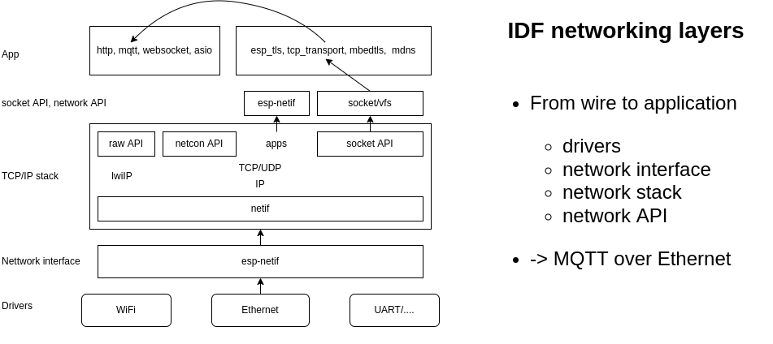
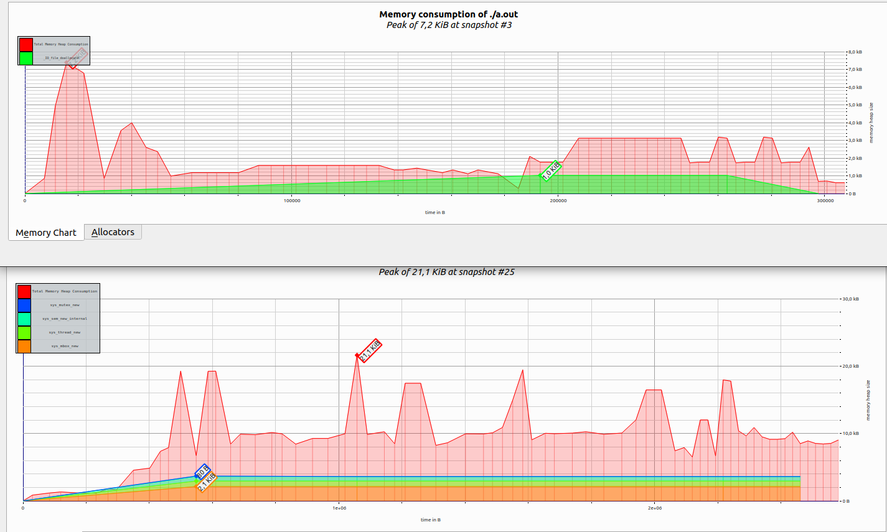

# lwIP for IDF developers

*Everything You Always Wanted to Know About `lwip`...*

* lwIP Overview
* IDF port layer
* lwIP vs esp-lwip
* Tips and Tweaks
* How we debug/test lwip
* Future considerations

---



---

# Demo: TCP connection

*TCP socket example*

```
sudo tshark -i lo -f "tcp port 3333"
nc -l 3333
```

* netcat client `nc localhost 3333`
* default socket client
* lwip socket client

---

# lwIP overview

* supported features
* used by IDF
* structure -> netif -> IP -> UDP TCP, pbufs, memory, pcb
* threads, ports, core-locking

---

# Is lwIP light-weight?

* numbers for ESP32 (flash, heap, static)
  - | IPv4 | dual-stack | (IPv6)
* Configurable
* IDF config

---

# How light-weight lwIP is (demo)?

## Demo (socket server, mem-consumption)

```
valgrind --tool=massif --time-unit=ms  --stacks=yes ./example_app
```


---

# IDF port

- Used/supported API
- FreeRTOS
    - msg-api
    - TLS
    - core-locking
- netif (ethernet, wifi, thread)
- esp-netif

---

#  lwIP and esp-lwip

* Adjust various parameters
* api-msg (close from another thread)
* kill pcb in wait state(s)
* bugfixes
* sys-timers on demand (IGMP, )
* NAPT
* DNS fallback server
* IPv6 zoning

---

#  lwIP and esp-lwip

## Demo

* close/shutdown 
* connect vs. read (select, non-block

---

# Tips and Tricks

* config options to reduce memory (dualstack, buffers)
* TCP adjustments
* LWIP hooks

---

# How we debug/test lwip

* on host 
    - unit tests (check)
    - example_apps
    - fuzzing
* on target -- `IT_*`
* debug prints
* Demo: debugging on host

---

# Future consideration

* Cleanup patches
* Converge to upstream
* Focus on host tests
* Evaluate, measure, test
