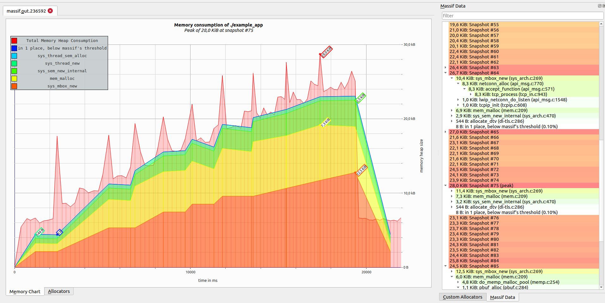

# lwIP for IDF developers

*Everything You Always Wanted to Know About `lwip`...*

* lwIP Overview
* IDF port layer
* lwIP vs esp-lwip
* Tips and Tweaks
* How we debug/test lwip
* Future considerations

---


---

# Demo: TCP connection

*TCP socket example*

```
sudo tshark -i lo/tap0 -f "tcp port 3333"
nc -l 3333
```

* netcat client `nc localhost 3333`
* default socket client
* lwip socket client

---

# lwIP overview

* [Supported protocols and features](https://github.com/espressif/esp-lwip/blob/76303df2386902e0d7873be4217f1d9d1b50f982/README#L14-L35)
* Features and configs used by IDF
* Layering: `netif` -> `IP` -> `UDP/TCP` -> `apps`
* Structures: pbufs, memp, pcb
* threads, ports, core-locking
---

# lwIP features -- Used in IDF

  * IP (Internet Protocol, IPv4 and IPv6), ICMP, IGMP, TCP/UDP
  * DHCP, AutoIP, DNS (mDNS)
  * MLD (Multicast listener discovery for IPv6), ND (Neighbor discovery and stateless address autoconfiguration for IPv6), Stateless DHCPv6
  * ~raw/native API for enhanced performance~
  * ~Optional~ Berkeley-like socket API
  * ~TLS: optional layered TCP ("altcp") for nearly transparent TLS for any TCP-based protocol (ported to mbedTLS) (see changelog for more info)~
  * PPPoS and ~PPPoE~ (Point-to-point protocol over Serial/Ethernet)
  * ~6LoWPAN (via IEEE 802.15.4, BLE or ZEP)~
---

# lwIP structures

* Packet buffers: pbufs
  - support of chaining, rewinding headers
  - types: (`PBUF_RAM`, `PBUF_ROM`, `PBUF_REF`, `PBUF_POOL`)
* Memory pools (`LWIP_MEMPOOL`, used in PPPoS)
* Protocol control block (`tcp_pcb`, `udp_pcb`, `ip_pcb`, `raw_pcb`)
  - e.g. [common/IP related PCB members](https://github.com/espressif/esp-lwip/blob/76303df2386902e0d7873be4217f1d9d1b50f982/src/include/lwip/ip.h#L72-L89)

---
# lwIP contrib

## ports, addons, examples, tests

* [FreeRTOS port](https://github.com/lwip-tcpip/lwip/tree/master/contrib/ports/freertos)
* [Addons](https://github.com/lwip-tcpip/lwip/tree/master/contrib/addons)

---

# Is lwIP light-weight?

* numbers for ESP32 (flash, heap, static)
```
            Archive File DRAM .data .rtc.data DRAM .bss IRAM0 .text & 0.vectors ram_st_total Flash .text & .rodata & .rodata_noload & .appdesc flash_total

               nd6.c.obj          8         0       932           0           0          940       11483       252                0          0       11743
            tcp_in.c.obj          0         0        52           0           0           52        8752      1243                0          0        9995
               tcp.c.obj          2         0        26           0           0           28        6484      1760                0          0        8246
           tcp_out.c.obj          0         0         0           0           0            0        5686      2165                0          0        7851
           sockets.c.obj          0         0       648           0           0          648        6947       757                0          0        7704
           api_msg.c.obj          0         0         0           0           0            0        6070      1487                0          0        7557
               ecp.c.obj          0         0        12           0           0           12        7326        88                0          0        7414
          wpa_auth.c.obj          0         0        68           0           0           68        7282        82                0          0        7364
              dhcp.c.obj          0         0        69           0           0           69        5785       804                0          0        6589
               dns.c.obj          0         0      1322           0           0         1322        5414       251                0          0        5665
    esp_netif_lwip.c.obj          0         0        14           0           0           14        4116      1394                0          0        5510
               ip6.c.obj          0         0         0           0           0            0        4236       112                0          0        4348
               udp.c.obj          2         0         4           0           0            6        4000       292                0          0        4294
             netif.c.obj          0         0       301           0           0          301        2631       833                0          0        3464
            etharp.c.obj          0         0       241           0           0          241        2796       598                0          0        3394
              pbuf.c.obj          0         0         1           0           0            1        2513       755                0          0        3268
          phy_init.c.obj         16         0        22         172           0          210        1491      1259                0          0        2938
               raw.c.obj          0         0         4           0           0            4        2394       219                0          0        2613
           api_lib.c.obj          0         0         0           0           0            0        2021       255                0          0        2276
               ip4.c.obj          0         0         6           0           0            6        1771       127                0          0        1898
              igmp.c.obj          0         0         9           0           0            9        1584       252                0          0        1836
              mld6.c.obj          0         0         1           0           0            1        1790         0                0          0        1790
          sys_arch.c.obj          0         0         8           0           0            8        1039       575                0          0        1614
       cache_utils.c.obj          4         0        14         868           0          886          81       511                0          0        1464
    heap_caps_init.c.obj          0         0         4           0           0            4         878       432                0          0        1310
         wifi_init.c.obj         12         0         5           0           0           17         575       690                0          0        1277
          rtc_init.c.obj          0         0         0           0           0            0        1072         0                0          0        1072
          ip6_addr.c.obj          0         0         0           0           0            0         972        32                0          0        1004
             tcpip.c.obj          0         0        16           0           0           16         681       256                0          0         937
              icmp.c.obj          0         0         0           0           0            0         704       227                0          0         931
          timeouts.c.obj          0         0        12           0           0           12         547       289                0          0         836
          ip4_addr.c.obj          0         0         0           0           0            0         685       124                0          0         809
        multi_heap.c.obj        159         0         0         649           0          808           0         0                0          0         808
             netdb.c.obj          0         0         0           0           0            0         669       132                0          0         801
             icmp6.c.obj          0         0         0           0           0            0         599       189                0          0         788
        wifi_netif.c.obj          0         0        16           0           0           16         455       306                0          0         761
esp_flash_spi_init.c.obj         72         0         4           0           0           76         215       261                0          0         548
       inet_chksum.c.obj          0         0         0           0           0            0         531         0                0          0         531
            wlanif.c.obj          0         0         0           0           0            0         427        70                0          0         497
          ethernet.c.obj          0         0         0           0           0            0         369       127                0          0         496
          ip4_frag.c.obj          0         0         0           0           0            0         397        92                0          0         489
          vfs_lwip.c.obj          0         0         0           0           0            0         335       141                0          0         476
          ip6_frag.c.obj          0         0         4           0           0            4         381        84                0          0         465
              memp.c.obj          0         0         0           0           0            0         200       256                0          0         456
   tcp_isn_default.c.obj          0         0        68           0           0           68         309         0                0          0         309
               mem.c.obj          0         0         0           0           0            0         156       137                0          0         293
           esp_err.c.obj        108         0         0         140           0          248           0         0                0          0         248
               eap.c.obj          0         0         4           0           0            4         237         0                0          0         237
       newlib_init.c.obj        144         0       240           0           0          384          81         0                0          0         225
            netbuf.c.obj          0         0         0           0           0            0         125        92                0          0         217
               def.c.obj          0         0         0           0           0            0         153         0                0          0         153
                ip.c.obj          0         0        68           0           0           68         125        24                0          0         149
            ethip6.c.obj          0         0         0           0           0            0         128         0                0          0         128
               err.c.obj          0         0         0           0           0            0          44        68                0          0         112
              heap.c.obj          0         0         0          92           0           92           0         0                0          0          92
        reent_init.c.obj          0         0         0          63           0           63           0         0                0          0          63
       xtensa_init.c.obj          0         0         4          32           0           36           0         0                0          0          32
              init.c.obj          0         0         0           0           0            0          32         0                0          0          32
           esp_mem.c.obj          0         0         0          30           0           30           0         0                0          0          30
    bootloader_mem.c.obj          0         0         0           0           0            0          13         0                0          0          13
        ethernetif.c.obj          0         0         0           0           0            0           0         0                0          0           0
          eap_peap.c.obj          0         0         0           0           0            0           0         0                0          0           0

               liblwip.a         12         0      3792           0           0         3804       94939     15227                0          0      110178
               liblwip.a          4         0      2191           0           0         2195       63340     14019                0          0       77363

tcpip_init() -- 4600 bytes (thread, 220B mbox)
sock_create() -- 500 bytes (mbox, mem pools, pcb)
sock_write() -- 3908 bytes (pbuf, tcp-segment)
```
* Configurable
  - Nr of sockets/connections
  - Buffers/windows
  - Features
  - TCPIP thread stack size
* IDF config
  - CONFIG_LWIP_IPV6, CONFIG_LWIP_DHCPS, ... (PPP, SLIP) 
  - CONFIG_LWIP_MAX_SOCKETS, CONFIG_LWIP_MAX_ACTIVE_TCP, CONFIG_LWIP_MAX_LISTENING_TCP, CONFIG_LWIP_MAX_UDP_PCBS 
  - CONFIG_LWIP_TCP_SND_BUF_DEFAULT, CONFIG_LWIP_TCP_WND_DEFAULT, CONFIG_LWIP_TCP_RECVMBOX_SIZE, CONFIG_LWIP_UDP_RECVMBOX_SIZE, CONFIG_LWIP_TCPIP_RECVMBOX_SIZE
  - CONFIG_LWIP_TCPIP_TASK_STACK_SIZE
---

# How light-weight lwIP is (demo)?

## Demo (socket server, mem-consumption)

```
valgrind --tool=massif --time-unit=ms  --stacks=yes ./example_app
```


---

```
--------------------------------------------------------------------------------
Command:            ./example_app
Massif arguments:   --threshold=0.1 --time-unit=ms --stacks=yes
ms_print arguments: massif.out.156121
--------------------------------------------------------------------------------


    MB
1.431^                                                                     :::
     |                                                                 @@@#:::
     |                                                            @@@@@@@@#:::
     |                                                         @@@@@@@@@@@#:::
     |                                                    @@@@@@@@@@@@@@@@#:::
     |                                                @@@@@@@@ @@@@@@@@@@@#:::
     |                                             @::@ @@@@@@ @@@@@@@@@@@#:::
     |                                         @@::@::@ @@@@@@ @@@@@@@@@@@#:::
     |                                     @::@@@::@::@ @@@@@@ @@@@@@@@@@@#:::
     |                                  @@@@: @@@::@::@ @@@@@@ @@@@@@@@@@@#:::
     |                              ::::@ @@: @@@::@::@ @@@@@@ @@@@@@@@@@@#:::
     |                           @@@: ::@ @@: @@@::@::@ @@@@@@ @@@@@@@@@@@#:::
     |                       :::@@ @: ::@ @@: @@@::@::@ @@@@@@ @@@@@@@@@@@#:::
     |                    @@@: :@@ @: ::@ @@: @@@::@::@ @@@@@@ @@@@@@@@@@@#:::
     |                 @@@@@@: :@@ @: ::@ @@: @@@::@::@ @@@@@@ @@@@@@@@@@@#:::
     |              @@@@@@@@@: :@@ @: ::@ @@: @@@::@::@ @@@@@@ @@@@@@@@@@@#:::
     |           :@@@@@@@@@@@: :@@ @: ::@ @@: @@@::@::@ @@@@@@ @@@@@@@@@@@#:::
     |        @@@:@ @@@@@@@@@: :@@ @: ::@ @@: @@@::@::@ @@@@@@ @@@@@@@@@@@#:::
     |      ::@@@:@ @@@@@@@@@: :@@ @: ::@ @@: @@@::@::@ @@@@@@ @@@@@@@@@@@#:::
     |    ::::@@@:@ @@@@@@@@@: :@@ @: ::@ @@: @@@::@::@ @@@@@@ @@@@@@@@@@@#:::
   0 +----------------------------------------------------------------------->s
     0                                                                   24.96

Number of snapshots: 81
 Detailed snapshots: [7, 8, 9, 11, 12, 13, 14, 15, 16, 17, 18, 19, 20, 23, 24, 25, 29, 30, 31, 33, 34, 3
5, 38, 41, 42, 43, 44, 45, 46, 47, 48, 50, 52, 54, 56, 58, 60, 62, 64, 66, 68, 70, 72, 74, 76 (peak)]

--------------------------------------------------------------------------------
  n       time(ms)         total(B)   useful-heap(B) extra-heap(B)    stacks(B)
--------------------------------------------------------------------------------
  0              0                0                0             0            0
  1            375            5,488                0             0        5,488
  2            793           42,784           39,688         1,368        1,728
  3          1,040           68,304           64,304         2,184        1,816
  4          1,468          110,128          104,848         3,528        1,752
  5          2,082          160,960          154,080         5,160        1,720
  6          2,444          193,952          185,936         6,216        1,800
  7          2,933          234,096          224,648         7,480        1,968
95.96% (224,648B) (heap allocation functions) malloc/new/new[], --alloc-fns, etc.
->70.45% (164,920B) 0x16B54B: sys_mbox_new (sys_arch.c:249)
| ->70.00% (163,856B) 0x144A24: netconn_alloc (api_msg.c:770)
| | ->70.00% (163,856B) 0x141BF6: netconn_new_with_proto_and_callback (api_lib.c:155)
| |   ->70.00% (163,856B) 0x14AF9B: lwip_socket (sockets.c:1720)
| |     ->70.00% (163,856B) 0x10B986: tcp_bind_test (socket_examples.c:103)
| |       ->70.00% (163,856B) 0x10F72D: main (socket_examples.c:941)
| |         
| ->00.45% (1,064B) in 1+ places, all below ms_print's threshold (01.00%)
| 
->25.22% (59,040B) 0x16BC75: sys_sem_new_internal (sys_arch.c:450)
| ->06.32% (14,784B) 0x16B582: sys_mbox_new (sys_arch.c:254)
| | ->06.27% (14,688B) 0x144A24: netconn_alloc (api_msg.c:770)
| | | ->06.27% (14,688B) 0x141BF6: netconn_new_with_proto_and_callback (api_lib.c:155)
| | |   ->06.27% (14,688B) 0x14AF9B: lwip_socket (sockets.c:1720)
| | |     ->06.27% (14,688B) 0x10B986: tcp_bind_test (socket_examples.c:103)
| | |       ->06.27% (14,688B) 0x10F72D: main (socket_examples.c:941)
| | |         
| | ->00.04% (96B) in 1+ places, all below ms_print's threshold (01.00%)
| | 
```

# IDF port

- Used/supported API
- FreeRTOS
    - msg-api
    - TLS
    - core-locking
- netif (ethernet, wifi, thread)
- esp-netif

---

#  lwIP and esp-lwip

* Adjust various parameters
* api-msg (close from another thread)
* kill pcb in wait state(s)
* bugfixes
* sys-timers on demand (IGMP, )
* NAPT
* DNS fallback server
* IPv6 zoning

---

#  lwIP and esp-lwip

* show statistics
## Demo

* close/shutdown 
* connect vs. read (select, non-block

---

# Tips and Tricks

* config options to reduce memory (dualstack, buffers)
* TCP adjustments
* LWIP hooks

---

# How we debug/test lwip

* on host 
    - unit tests (check)
    - example_apps
    - fuzzing
* on target -- `IT_*`
* debug prints
* Demo: debugging on host

---

# Future consideration

* Cleanup patches
* Converge to upstream
* Focus on host tests
* Evaluate, measure, test

---

# Takeaways

* DNS servers are global
* No deinit
* timeouts (connect, NULL-tv)

